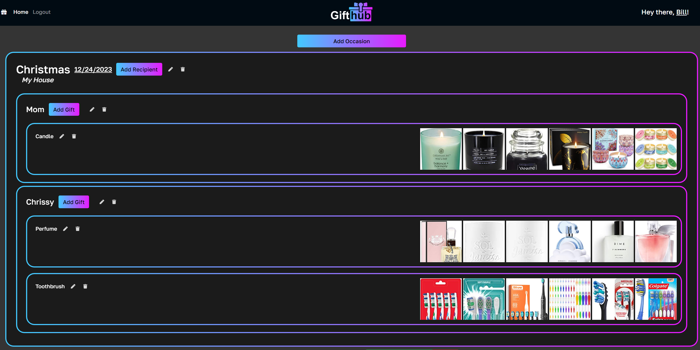

  
  # Gifthub

  ## Description

  A one stop site for planning out your gift givings!

  ## Table of Contents

  - [Installation](#installation)
  - [Usage](#usage)
  - [Credits](#credits)
  - [License](#license)
  - [Contributions](#contributions)
  - [Questions](#questions)

  ## Installation

  Click on the link to our deploy! Or, download it, run npm i, and change the ENV variables to fit your sql server.

  ## Usage

  This project's easy to use UI will guide you into making occassions, recipients, and gifts so that you can make your plans accordingly
  

  ## Credits

  https://github.com/dfgalus  
  https://github.com/kdnagpal

  ## License

  This application is covered under the MIT license. Read more at [License: MIT](https://opensource.org/licenses/MIT)

  ## Contributions

  Email me and we can talk it over

  ## Questions

  1. Where can I find your github so that I can view your other projects? https://github.com/scicluna

  2. What email address should I use to contact you regarding further opportunities or questions? sciclunajl@gmail.com
